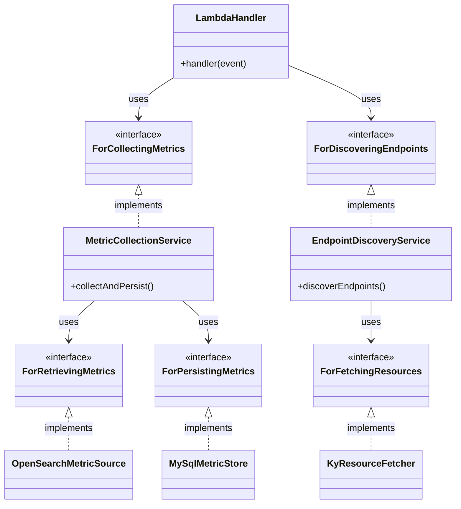

# OS Key Figures

A Lambda function that collects API usage statistics from OpenSearch access logs and persists them to a MySQL database for visualization and analysis.

## Table of Contents

- [Overview](#overview)
- [Design](#design)
- [Configuration](#configuration)
- [Extending the Code](#extending-the-code)
  - [Adding a New Metric](#scenario-1-adding-a-new-metric)
  - [Adding a New Service](#scenario-2-adding-a-new-service)
- [Integration Tests](#integration-tests)

---

## Overview

This Lambda collects metrics such as:
- HTTP request counts
- Bytes transferred
- Unique IP addresses
- Top referers, user agents, and digitraffic-users

Metrics are collected per-service (RAIL, ROAD, MARINE, AFIR) and per-endpoint.

---

## Design

The codebase follows **Hexagonal Architecture (Ports and Adapters)**:



### Key Concepts

#### Domain Types

| Term | Description |
|------|-------------|
| **Service** | Enum representing Digitraffic services: `RAIL`, `ROAD`, `MARINE`, `AFIR`, `ALL` |
| **MetricScope** | Defines *what* we're collecting metrics for — a service, optionally an endpoint, and a `storageTag` for database persistence |
| **MetricDefinition** | Defines *which* metric to collect — name and value type (`SCALAR` or `CATEGORICAL_COUNTS`) |
| **TimePeriod** | The time range for metric collection (`from`/`to` dates) |

#### Error Types

| Term | Description |
|------|-------------|
| **CollectionError** | Base error class with context: scope, definition, input values, and stack trace |
| **MetricSourceError** | Error from data retrieval (OpenSearch). Extends `CollectionError` with optional `statusCode` |
| **MetricStoreError** | Error from persistence (MySQL). Extends `CollectionError` with optional `operation` name |

#### Domain Services

| Term | Description |
|------|-------------|
| **MetricCollectionService** | Orchestrates metric collection — retrieves metrics via `ForRetrievingMetrics` port and persists via `ForPersistingMetrics` port. Implements `ForCollectingMetrics` driving port |
| **EndpointDiscoveryService** | Discovers API endpoints from OpenAPI specs and custom configurations. Uses `ForFetchingResources` port. Implements `ForDiscoveringEndpoints` driving port |

---

## Configuration

Configuration is loaded from environment variables in `handler-config.ts`

---

## Extending the Code

This section describes how to extend the codebase for adding a new metric or a new service.

### Scenario 1: Adding a New Metric

**Situation:** A new metric needs to be collected from the services.

#### Steps

**Step 1: Add the metric definition** (`src/lambda/handler-config.ts`)

```typescript
function createMetricDefinitions(): MetricDefinition[] {
  return [
    // ... existing metrics
    { name: "New Metric Name", valueType: MetricValueType.SCALAR },
  ];
}
```

**Step 2: Add the query logic** (`src/adapters/driven/opensearch/opensearch-metric-source.ts`)

Add a new case in `getMetricQuery()`:

```typescript
case "New Metric Name":
  return new CountMetricQuery(
    this.config.accountNames,
    definition.name,
    index,
    'request:"\\/api\\/v2\\/graphql*"',  // Additional query condition
  );
```

If the metric requires a new query pattern (not COUNT, SUM, CARDINALITY, or TERMS), you'll need to create a new `MetricQuery` subclass in `metric-query.ts`.

If the metric uses a different OpenSearch index, update `getMetricQuery()` to handle index selection based on the metric scope and definition. 

---

### Scenario 2: Adding a New Service

**Situation:** A new service (e.g., "NEW_SERVICE") has been developed, and we want to collect the same metrics from it.

#### Steps

**Step 1: Add to the Service enum** (`src/domain/types/service.ts`)

```typescript
export enum Service {
  ALL = "*",
  RAIL = "rail",
  ROAD = "road",
  MARINE = "marine",
  AFIR = "afir",
  NEW_SERVICE = "new_service",  // Add new service
}

// Update parseService() function
export function parseService(value: string): Service {
  // ... existing cases
  case "new_service":
    return Service.NEW_SERVICE;
  // ...
}
```

**Step 2: Add OpenAPI URL for endpoint discovery** (`src/lambda/handler-config.ts`)

```typescript
function createEndpointDiscoveryConfig(): EndpointDiscoveryConfig {
  const openApiUrls = new Map<Service, string>([
    // ... existing entries
    [Service.NEW_SERVICE, "https://new_service.digitraffic.fi/swagger/openapi.json"],
  ]);
  // ...
}
```

**Step 3: Add any custom endpoints** (if needed)

```typescript
const customEndpoints = new Map<Service, string[]>([
  // ... existing entries
  [Service.NEW_SERVICE, ["/api/custom/endpoint"]],
]);
```

**Step 4: Update account names configuration**

```typescript
function createAccountNames(): Record<Service, string> {
  return {
    // ... existing entries
    [Service.NEW_SERVICE]: getEnvVariable("NEW_SERVICE_ACCOUNT_NAME"),
  };
}
```

**Step 5: Add environment variables and collect statistics for the new service** (`os-key-figures-stack.ts`)

Add environment variables to `lambdaConf` and add a new rule.

**Step 6 (OPTIONAL): Visualize the new service metrics**

- **Update create-visualizations.ts Lambda**: Add the new service into the HTML generation logic.
- **Update digitraffic-statistics project**: Update the `digitraffic-statistics` project to include it.

---

## Integration Tests

Integration tests use Docker Compose to spin up OpenSearch and MySQL containers.

### Running the Tests

#### 1. Start the test containers

```bash
pnpm run test:integration:setup
```

Wait for containers to be healthy (about 10-30 seconds).

#### 2. Run the integration tests

```bash
pnpm run test:integration
```

#### 3. Stop the containers when done

```bash
pnpm run test:integration:teardown
```

### One-liner (all steps)

```bash
pnpm run test:integration:setup && pnpm run test:integration && pnpm run test:integration:teardown
```

### Run a specific test

```bash
pnpm run test:integration --test-name-pattern "TEST_NAME"
```

### Test Structure

- **`src/__test__/integration/docker-compose.yml`** - Defines OpenSearch (port 9200) and MySQL (port 3306)
- **`src/__test__/integration/setup.ts`** - Test utilities for seeding data and managing test infrastructure

### Troubleshooting

**OpenSearch not ready:**
```bash
curl http://localhost:9200/_cluster/health
```
Should return `status: "green"` or `"yellow"`.

**Clean restart:**
```bash
pnpm run test:integration:teardown
docker volume prune -f
pnpm run test:integration:setup
```
